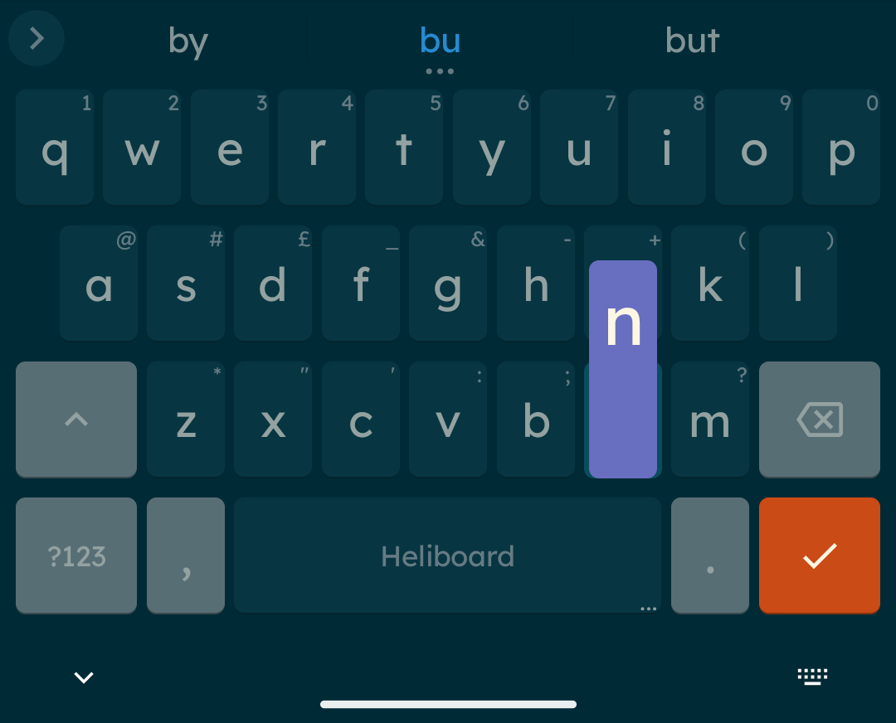

# Android Themes Collection

Some custom themes for Heliboard keyboard and Kvaesitso launcher on Android, WIP! warning: future app updates may break these themes.

## Heliboard Themes

**Settings:** These themes are designed with Style & Icon Style set to 'Material', Key Borders and Narrow Key Gap set to 'On'.

**Complexity Guide:** Heliboard offers 3 keyboard appearance settings:
- **"Show Main Colors" (7 fields)** - Simple themes that are future-proof and less likely to need updates
- **"Show More Colors" (10 fields)** - Medium complexity (no themes currently use this setting)
- **"Show All Colors" (41+ fields)** - Complex themes with detailed customization but small risk of needing updates

### Show Main Colors (Future-Proof)

| Theme Name | Screenshot |
|------------|------------|
| [Dark Nord](Heliboard-themes/Dark-Nord.json) |  |
| [Light Botanical Garden](Heliboard-themes/Light-Botanical-Garden.json) |  |
| [Light Olivia](Heliboard-themes/Light-Olivia.json) |  |

### Show All Colors (Complex)

| Theme Name | Screenshot |
|------------|------------|
| [Dark Cyberpunk Neon](Heliboard-themes/Dark-Cyberpunk-Neon.json) |  |
| [Dark Kanagawa Wave](Heliboard-themes/Dark-Kanagawa-Wave.json) |  |
| [Dark Rose Pine Moon](Heliboard-themes/Dark-rose-pine-moon.json) |  |
| [Dark Solarized Flare](Heliboard-themes/Dark-Solarized-Flare.json) |  |
| [Dark Tokyo Night Moon](Heliboard-themes/Dark-Tokyo-Night-Moon.json) |  |
| [Dark Tokyo Night Storm](Heliboard-themes/Dark-Tokyo-Night-Storm.json) |  |
| [Light Rose Pine Dawn](Heliboard-themes/Light-rose-pine-dawn.json) |  |
| [Light Rose Pine Morning Dew](Heliboard-themes/Light-Rose-Pine-Morning-Dew.json) |  |
| [Light Rosé Pine Dawn](Heliboard-themes/Light-Rosé-Pine-Dawn.json) |  |
| [Light Solarized Blue](Heliboard-themes/Light-Solarized-Blue.json) |  |
| [Light Solarized Desert Sun](Heliboard-themes/Light-Solarized-Desert-Sun.json) |  |
| [Light Solarized Oasis](Heliboard-themes/Light-Solarized-Oasis.json) |  |
| [Light Vaporwave Sunset](Heliboard-themes/Light-Vaporwave-Sunset.json) |  |

## Kvaesitso Themes

**Note:** These themes include both dark and light variants that automatically switch with Android's system theme. Many more color variants are available in the folder than shown in screenshots below.

| Theme Family | Light Variant | Dark Variant |
|--------------|---------------|--------------|
| **Ayu** |  |  |
| **Ayu Mirage** |  |  |
| **Everforest** |  |  |
| **Gruvbox** |  |  |
| **Kanagawa** |  |  |
| **Tokyo Night** |  |  |

### Available Theme Variants

- **Ayu**: Light/Dark adaptive and Light/Mirage adaptive versions
- **Everforest**: Light/Dark adaptive with green accent
- **Gruvbox**: Light/Dark adaptive in 7 color variants (Aqua, Blue, Green, Orange, Purple, Red, Yellow)
- **Kanagawa**: Lotus/Dragon and Lotus/Wave adaptive versions in 6 color variants (Aqua, Green, Orange, Red, Violet, Yellow)
- **Rose Pine**: Dawn/Main and Dawn/Moon adaptive versions in 6 color variants (Foam, Gold, Iris, Love, Pine, Rose)
- **Tokyo Night**: Day/Night, Day/Moon, and Day/Storm adaptive versions with blue accent

## Acknowledgments

This collection wouldn't be possible without the amazing work of the open-source community. Special thanks to:

### Applications
- **[Kvaesitso](https://github.com/MM2-0/Kvaesitso)** - A search-focused Android launcher
- **[Heliboard](https://github.com/Helium314/HeliBoard)** - Privacy-conscious keyboard for Android

### Theme Palettes & Color Schemes
- **[Rose Pine](https://rosepinetheme.com/)** - All natural pine, faux fur and a bit of soho vibes
- **[Gruvbox](https://github.com/morhetz/gruvbox)** - Retro groove color scheme
- **[Tokyo Night](https://github.com/enkia/tokyo-night-vscode-theme)** - A clean, dark theme inspired by Tokyo's neon-lit skyline
- **[Kanagawa](https://github.com/rebelot/kanagawa.nvim)** - Dark colorscheme inspired by Katsushika Hokusai's famous painting
- **[Ayu](https://github.com/ayu-theme/ayu-colors)** - Modern theme with bright colors
- **[Everforest](https://github.com/sainnhe/everforest)** - Green based color scheme designed to be warm and soft
- **[Solarized](https://ethanschoonover.com/solarized/)** - Precision colors for machines and people
- **[Nord](https://www.nordtheme.com/)** - Arctic, north-bluish color palette

Thank you to all the developers and designers who created these beautiful color schemes and applications!
